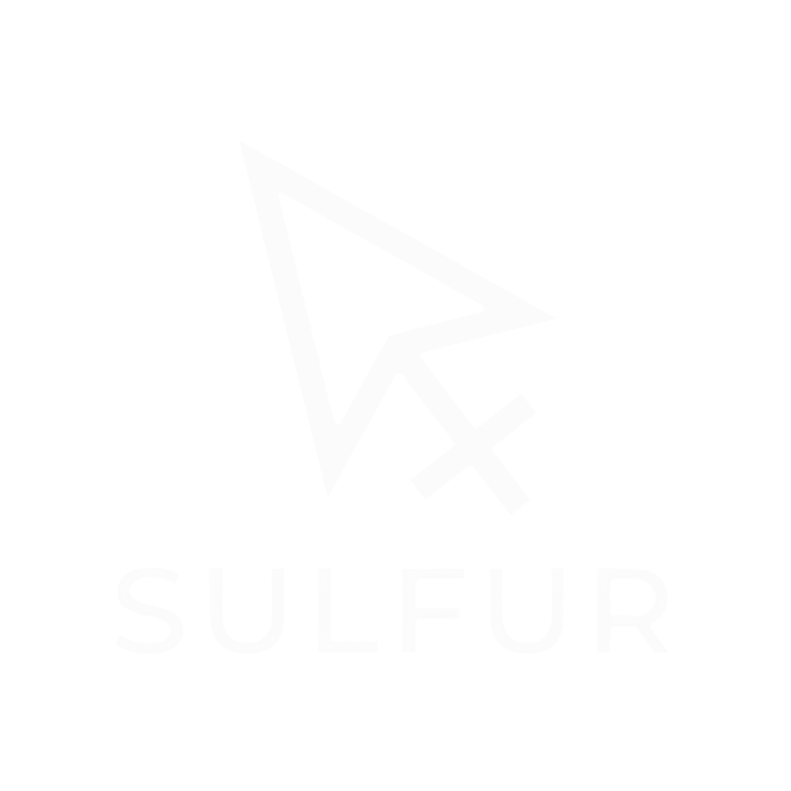
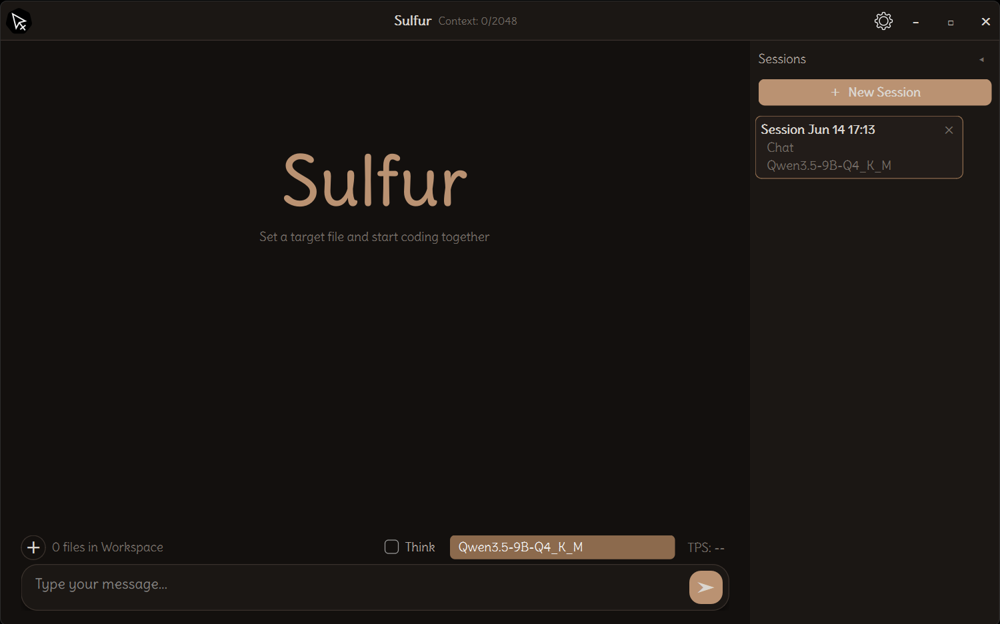

<p align="center">
  <a>
    <picture>
      <source srcset=".github/assets/logo-black.png" media="(prefers-color-scheme: dark)">
      <source srcset=".github/assets/logo-white.png" media="(prefers-color-scheme: light)">
      
    </picture>
  </a>
   <a>
    <picture>
      
    </picture>
  </a>
</p>

<p align="center">Open source AI coding agent.</p>
Inspired by [OpenCode](https://opencode.ai) and [Pi Agent](https://github.com/anomalyco/pi). I Built it to learn how local LLMs actually work: from llama.cpp subprocess management to streaming tool calls. Chat with an AI that can read, write, edit, and search files in your workspace, all running on your machine.

## Features

- **100% Local**: No cloud, no telemetry, no data leaves your machine
- **Multi-Backend**: llama.cpp, LM Studio, or Ollama
- **Tool Calling**: AI can read, write, edit, and search your files with permission controls
- **Streaming Responses**: Real-time streaming chat with smooth rendering
- **Session Management**: Create, switch, rename, and delete chat sessions
- **Workspace Attachments**: Attach files and folders for the AI to work with
- **11 Color Themes**: Sulfur, Daylight, Void, Aqua, Cherry, Forest, Fire, Nebula, Slate, Amber, Emerald
- **Hardware Tuning**: Exposed low-level controls context size, thread count, GPU layers, KV cache quantization, flash attention, prompt caching, MLOCK, MoE CPU layers
- **PDF Parsing**: Ingest and analyze PDF documents

## Prerequisites

- **Windows**
- **Python 3.11+** (3.12 recommended)
- **llama.cpp backend**: NVIDIA GPU with CUDA drivers. **LM Studio / Ollama backends**: any GPU works, including non-NVIDIA
- **GGUF model files** placed in the `models/` directory

## Quick Start

```bash
# Clone the repository
git clone https://github.com/chocopichu/sulfur.git
cd sulfur

# Create and activate a virtual environment
python -m venv .venv
.venv\Scripts\activate

# Install dependencies
pip install -r requirements.txt

# Place your GGUF model(s) in the models/ folder

# Run the app
python brain.py
```

Or simply double-click `run.bat`.

### Setting up llama.cpp (optional)

If you plan to use the built-in llama.cpp backend instead of LM Studio or Ollama:

1. Download the latest `llama-server` binary from the [llama.cpp releases](https://github.com/ggerganov/llama.cpp/releases)
2. Place the following in `bin/llama-cpp-cuda/`:
   - `llama-server.exe`
   - `llama.dll`, `ggml.dll`, `ggml-cuda.dll`
   - CUDA runtime DLLs (`cublas*.dll`, `cudart*.dll`)
3. The app will spawn `llama-server.exe` as a subprocess and communicate over its OpenAI-compatible API

> **Note:** the `bin/` directory is gitignored. Binaries are not included in the repo.

## Configuration

All settings are stored in `preferences.json` and can be adjusted from the in-app Settings dialog:

| Setting | Description |
|---------|-------------|
| `BACKEND_TYPE` | `llama_cpp`, `lm_studio`, or `ollama` |
| `NUM_CTX` | Context window size |
| `TEMPERATURE` | Response randomness (0.0–2.0) |
| `GPU_LAYERS` | Layers offloaded to GPU (`-1` = all) |
| `ALLOW_FILE_EDITS` | Enable/disable file editing |
| `AUTO_APPLY_EDITS` | Auto-apply edits without confirmation |

## Project Structure

```
├── brain.py              # Entry point
├── run.bat              # Windows launcher
├── requirements.txt      # Python dependencies
├── src/modules/          # Core logic (backends, inference, sessions, tools)
├── ui/                   # PyQt6 GUI (chat, sidebar, settings, title bar)
├── bin/llama-cpp-cuda/   # llama.cpp binaries (download separately, see below)
├── models/               # GGUF model files (gitignored)
├── instructions/         # System prompt templates
└── sessions/             # Per-session chat history (gitignored)
```

## Tech Stack

| Layer | Technology |
|-------|------------|
| Language | Python 3.12+ |
| GUI | PyQt6 |
| Inference | llama.cpp / LM Studio / Ollama |
| Doc Parsing | PyMuPDF |


## Acknowledgements

- [llama.cpp](https://github.com/ggerganov/llama.cpp) for local LLM inference
- [PyQt6](https://www.riverbankcomputing.com/software/pyqt/) for the GUI framework
- [PyMuPDF](https://pymupdf.readthedocs.io/) for PDF parsing
